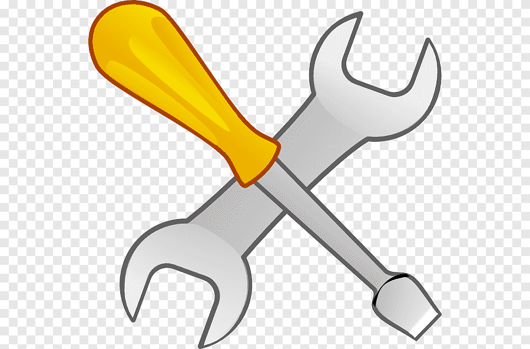
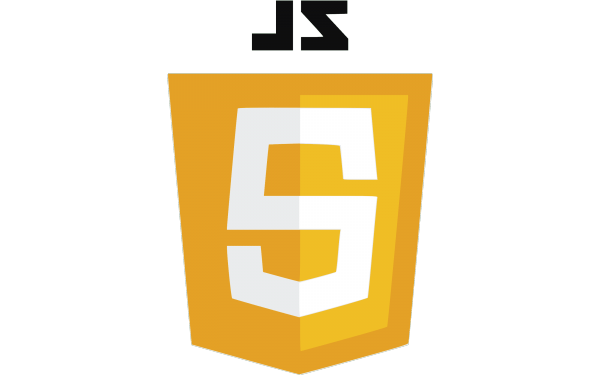

# ToDo_app 

>### Este é um simples ToDo List que explora recursos do browser, como **localstorage** para armazenamento.

## Tools 
* 
  * 
* 
* 

__*STEP-BY-STEP*__
1. Pegar o value do input ao clicar no button.

2. Colocar o valor em localstorage via `localstorage.setItem()` 

3. Renderizar na tela por meio da função `map`, os elementos gravados no localstorage e chamar a função no início da aplicação.

4. Criar uma função para editar e uma para deletar usando o index como parâmetro.

